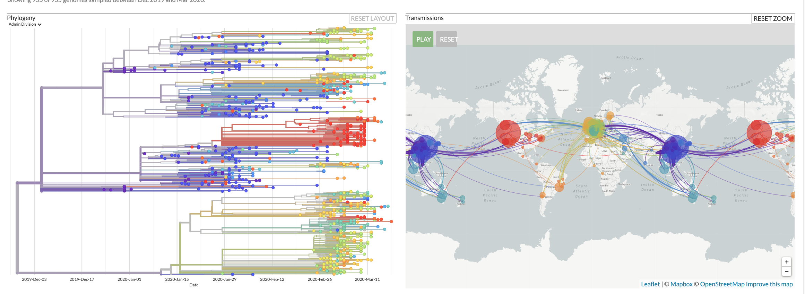

# Evolución UniAndes 2020-10
    
    Profesor: C. Daniel Cadena (ccadena@uniandes.edu.co) 
    Materiales para curso virtual de Evolución, Universidad de los Andes
    Horario: martes, miércoles y jueves, 9:30-10:20 am
    Aula Virtual en SicuaPlus
       
# Primer Módulo: La Teoría Evolutiva Aplicada a Comprender una Pandemia: el caso de COVID-19

Distribución geográfica y filogenia de basada en genomas del corononavirus SARS-CoV-2, causante de la pandemia de COVID-19. Imagen tomada el 23 de marzo de 2020 del proyecto [Nexstrain](https://nextstrain.org/).
    
## Objetivos de aprendizaje

-	Comprender cómo los análisis filogenéticos pueden emplearse para monitorear la expansión de una enfermedad infecciosa emergente.

-	Usando como estudio de caso la pandemia de COVID-19, conocer cómo conceptos fundamentales en evolución pueden aplicarse a un problema de salud pública con importantes implicaciones para la sociedad.

## Competencias a desarrollar

-	Habilidad para hacer inferencias biogeográficas a partir de árboles filogenéticos.

-	Capacidad de divulgar información científica para un público amplio mediante una infografía.

## Instrucciones para los estudiantes

### Martes 24 de marzo

Como todos sabemos, nos enfrentamos a una pandemia

