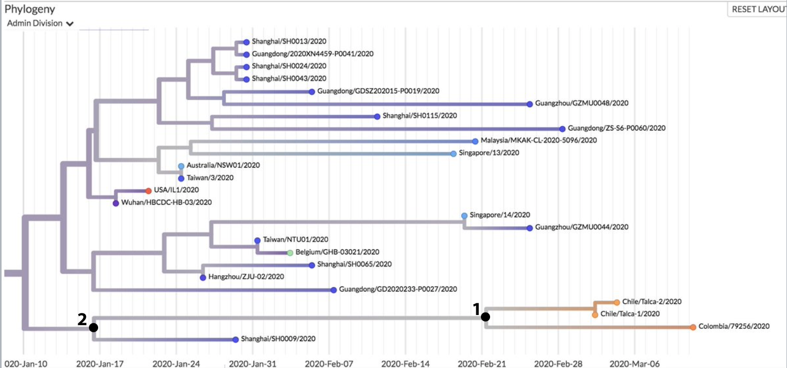

# Evolución 
    
    Curso Virtual, Universidad de los Andes 2020-10
    Profesor: C. Daniel Cadena (ccadena@uniandes.edu.co)
    Asistente Graduada: María Alejandra Meneses (ma.meneses10@uniandes.edu.co)    
    Horario: martes, miércoles y jueves, 9:30-10:20 am en SicuaPlus

       
# La Teoría Evolutiva Aplicada a Comprender una Pandemia: el Caso de COVID-19

Distribución geográfica y filogenia de basada en genomas del corononavirus SARS-CoV-2, causante de la pandemia de COVID-19. Imagen tomada el 23 de marzo de 2020 del proyecto [Nexstrain](https://nextstrain.org/).
    
## Objetivos de aprendizaje

-	Comprender cómo los análisis filogenéticos pueden emplearse para monitorear la expansión de una enfermedad infecciosa emergente.

-	Usando como estudio de caso la pandemia de COVID-19, conocer cómo conceptos fundamentales en evolución pueden aplicarse a un problema de salud pública con importantes implicaciones para la sociedad.

## Competencias a desarrollar

-	Habilidad para hacer inferencias biogeográficas y evolutivas a partir de árboles filogenéticos.

-	Destreza en la aplicación correcta de conceptos evolutivos para el estudio de un problema de salud pública.

-	Capacidad de divulgar información científica para un público amplio mediante herramientas audiovisuales.

## Instrucciones para los estudiantes

### Antes de comenzar

Los estudiantes de UniAndes inscritos en este curso ya han tomado ocho semanas de introducción a la evolución. El material que desarrollaremos de ahora en adelante construye sobre esa base e introduce conceptos que estaban programados para fases más avanzadas del curso. Si bien personas externas no tuvieron acceso a las ocho semanas previas y no podrán participar de las clases virtuales pues éstas se impartirán a través de la plataforma cerrada de la universidad, he decidido dar libre acceso a todo el material para que a quien le interese la información pueda conocerla. Para facilidad de compartirlas, las presentaciones de las clases en este sitio estarán disponibles en un formato de baja resolución que espero sea suficiente para poder comprenderlas. Debo aclarar que no soy experto en detalles de este tema complejo, de forma que seguramente cometeré errores e imprecisiones. Los invito a enviarme correcciones y sugerencias para construir colectivamente un recurso valioso de información.

### Martes 24 de marzo

Vivimos una coyuntura única en la historia reciente de la humanidad. Esta coyuntura supone enormes desafíos para nuestra sociedad, pero al mismo tiempo representa una oportunidad de aplicar nuestros conocimientos y adquirir conocimentos nuevos en un contexto de gran importancia científica y social. Vamos a aprovechar esa oportunidad para estudiar la aplicación de herramientas que ya hemos trabajado en el curso (i.e. árboles filogenéticos) y para aprender sobre el papel que conceptos fundamentales en evolución juegan en el origen y propagación de agentes infecciosos. Dichos conceptos incluyen selección natural, adaptación, evolución molecular, especiación y coevolución, entre otros.

Hoy comenzamos la fase virtual de nuestro curso con una charla a través de la herramienta de **clase remota** de SicuaPlus acerca de aplicaciones del análisis filogenético para estudios de evolución de virus y otros patógenos que afectan la vida silvestre y a los humanos. La presentación está disponible [acá](https://github.com/cdanielcadena/evolucion/blob/master/clase1_git.pdf).

Como lectura complementaria introductoria, pueden revisar apartes el capítulo *Evolutionary Medicine* en el [libro texto](https://www.macmillanlearning.com/college/ca/product/Evolution/p/1936221551) de Zimmer & Emlen.

### Miércoles 25 de marzo

**Instrucciones** 

La primera media hora de la clase la vamos a dedicar a ver un vídeo de una conferencia dictada por [Trevor Bedford](https://twitter.com/trvrb), uno de los cerebros detrás de [Nexstrain](https://nextstrain.org/), un proyecto de acceso libre que busca explotar el potencial científico y de salud pública de datos genómicos de patógenos. Vea por su cuenta la conferencia titulada ["Real-time Tracking of Virus Evolution"](https://youtu.be/Ok2iZ9-cUlk) y nos encontraremos en la ventana de **clase remota** a las 10 am. Anote cualquier pregunta que le surja para discturir en el espacio de reunión virtual que tendremos.

**Desarrollo** 

Luego de que los estudiantes vieron la conferencia, hicimos un pequeño sondeo. Una pregunta apuntaba a examinar si habían prestado atención, y a conectar con un mensaje que quería dejarles hoy y que describo más adelante. Otra pregunta buscaba mostrarles que la terminología que se usa en sistemática filogenética es aplicable al caso del estudio de epidemias. Si bien varios no contestaron correctamente esta última, en la discusión demostramos la correcta utilización de los conceptos de monofilia y parafilia con base en ejemplos de filogenias de los virus de Zika y Ebola. 

Luego, conectando con la primera pregunta del sondeo, ilustramos lo que parece ser un patrón común en epidemias: los virus circulan en poblaciones humanas tiempo antes de que se manifiesten con efectos evidentes en la salud humana. Así sucedió con (1) HIV en los Estados Unidos en los 70s, (2) Zika en Brasil en 2014-2015 y (3) COVID-19 en el estado de Washington, Estados Unidos, en 2020. El COVID-19 circuló sin ser detectado por semanas en Washington, pero el caso de Zika en Brasil tomó un año y medio y el de HIV en Estados Unidos varios años. Este mensaje motivó preguntas de los estudiantes y nos permitió discutir brevemente sobre la importancia de las pruebas de diagnóstico para efectos de vigilancia epidemiológica. Mencionamos, en respuesta a una pregunta, que la demora entre la llegada de los virus a un lugar y su efecto evidente en salud pública puede deberse tanto a las demoras en la incubación de la enfermedad en los infectados (como en COVID-19) como a posibles cambios en el virus que incrementan su virulencia o transmisibilidad (como en HIV). 

Cerramos la cesión haciéndoles ver a los estudiantes que para inferir cuál fue el momento de introducción de un agente infeccioso a un lugar tenemos que hacer suposiciones que se basan en principios de evolución. Por esto mañana nos encontraremos para una clase virtual sobre bases de evolución molecular necesarias para continuar estudiando este tema. 

La presentación de hoy incluyendo el sondeo y los resultados está disponible [acá](https://github.com/cdanielcadena/evolucion/blob/master/clase2_git.pdf).

### Jueves 26 de marzo

Hoy tuvimos una sesión de clase introduciendo principios básicos de teoría de evolución molecular que son clave para comprender varios aspectos de las enfermedades infecciosas. Comenzamos discutiendo cómo los primeros estudios de variación genética en poblaciones naturales basados en técnicas como la electroforesis de proteínas produjeron resultados sorprendentes dado lo que muchos investigadores esperaban tras la Síntesis Moderna de la primera mitad del siglo XX. La evidencia empírica sugirió que las poblaciones contenían mucha más variabilidad genética que lo que se esperaría si la fuerza evolutiva principal fuera selección natural. Luego introdujimos la teoría neutral de evolución molecular de Kimura (y la teoría casi neutral de Ohta), que sugiere que la mayor parte de la variación genética tiene efectos neutros en el *fitness* y le atribuye un papel fundamental a la deriva genética como fuerza de cambio evolutivo. Terminamos explicando cómo podemos hacer inferencias acerca del papel de distintas formas de selección natural y de deriva en la evolución a partir de comparaciones de secuencias de ADN entre organismos emparentados o para los mismos organismos entre distintos momentos en el tiempo. El martes continuaremos hablando de evolución molecular terminando el tema de teoría neutral e introduciendo un marco conceptual clave para comprender la evolución de los virus que causan epidemias: la idea del reloj molecular. [Presentación](https://github.com/cdanielcadena/evolucion/blob/master/clase3_git.pdf).

### Sábado 28 de marzo

[Nexstrain](https://nextstrain.org/) anunció anoche la disponibilidad del primer genoma de SARS-CoV-2 secuenciado para [Colombia](https://twitter.com/nextstrain/status/1243662694642634752). La filogenia sugiere que este virus está más emparentado con virus de Chile, anidado dentro de un grupo de virus mayormente de China. Nótese la inferencia de la fecha de los ancestros comunes de dos genomas de Chile y el de Colombia, que sugiere que este virus habría llegado a Sur América en febrero (número 1) o incluso a mediados de enero (número 2). Esta figura nos servirá para ilustrar en nuestra próxima clase la diferencia entre formas de estimar la edad de grupos de organismos en análisis de datación basados en el reloj molecular (i.e. *crown age* vs. *stem age*), así como las dificultades que este tipo de inferencias implican por efectos de muestreo. **Spoiler**: con estos datos no podemos decir prácticamente nada sobre los orígenes y la dispersión del coronavirus en Colombia. Hay que secuenciar mucho más.

### Martes 31 de marzo

Hoy continuamos con una [presentación](https://github.com/cdanielcadena/evolucion/blob/master/clase4_git.pdf) hablando de evolución molecular. Si bien pareciera que la evidencia empírica basada en información genómica no apoya las predicciones de la teoría neutral pues buena parte de los genomas de muchos organismos parecen haber sido moldeados por diferentes tipos de selección y no por deriva, hablamos sobre el papel de la teoría neutral como un modelo nulo y explicamos el tipo de inferencias sobre adaptación y evolución por selección natural que pueden hacerse con datos genéticos en el contexto de una filogenia. Empezamos también a introducir la idea del reloj molecular, comenzando con la utilidad de organismos como virus para este tipo de trabajos dada la posibilidad de obtener secuencias de los mismos organismos en diferentes momentos y así estimar directamente sus tasas de sustitución. Luego pasamos a hablar de cómo se pueden usar fósiles para calibrar filogenias de forma que podamos hacer inferencias temporales en estudios evolutivos, e ilustramos algunas dificultades asociadas con la calibración basada en fósiles. Terminamos mencionando cómo la edad *crown* de un grupo puede diferir notoriamente de su edad *stem* e ilustramos cómo esto puede llevar a inferencias muy diferentes en casos como el de la llegada del coronavirus a Colombia, haciendo énfasis en que el número de genomas disponible para Colombia y otros lugares está lejos de ser adecuado para poder hacer inferencias sólidas.

### Miércoles 1 de abril

Dedicamos la [clase](https://github.com/cdanielcadena/evolucion/blob/master/clase5_git.pdf) a estudiar el uso de relojes moleculares, a diferentes maneras de calibrarlos usando fósiles y eventos biogeográficos y a los desafíos que implican aspectos como incertidumbre en la edad y posición filogenética de los fósiles, posibles discrepancias entre eventos geológicos y eventos en la historia de las especies y a situaciones en las que las tasas de sustitución varían entre ramas de un árbol filogenético. El mensaje general es que si bien existen métodos que permiten tener en cuenta varias fuentes de incertidumbre para hacer inferencias temporales en evolución, es importante conocer las limitaciones de análisis basados en el reloj molecular a la hora de interpretar resultados de este tipo de análisis, que muchas veces pueden ser inciertos. Como complemento a la clase, los estudiantes revisarán por su cuenta este [blog](https://bedford.io/blog/ncov-cryptic-transmission/), en el que se explica con principios de evolución molecular cómo podemos hacer inferencias sobre transmisión "críptica" del coronavirus, lo que podría darles más luces para entender la importancia del aislamiento social para contener la pandemia.

### Jueves 2 de abril

Día de aprendizaje activo en el que aplicamos las bases teóricas de las últimas tres clases al estudio de epidemias. Los estudiantes inicialmente revisaron un artículo científico que ilustra el uso de teoría evolutiva para comprender enfermedades emergentes y luego contestaron preguntas al respecto. Tuvieron la opción de escoger entre (a) un [estudio](https://bmcinfectdis.biomedcentral.com/articles/10.1186/s12879-019-4566-2) que analizó la transmisión de Zika en Colombia en 2014-2015 con árboles filogenéticos y aplicaciones del reloj molecular y (b) un [trabajo](https://journals.plos.org/plospathogens/article?id=10.1371/journal.ppat.1008191) sobre el uso de información genómica para determinar si la evolución de virus de influenza es explicable por selección (positiva o purificadora) o por procesos neutrales.

Inicialmente, los estudiantes tuvieron 20 minutos para dar una mirada rápida al artículo que escogieron. Les indicamos que lo más eficiente dado el poco tiempo disponible sería leer el resumen, analizar figuras y tablas, y revisar la discusión de resultados que hacen los autores. Pasados los 20 minutos, los estudiantes recibieron preguntas de guía y tuvieron otros 20 minutos para pensar cómo responderlas. Durante este tiempo, estuvo permitido discutir entre todos a través del chat de Blackboard Collaborate. Las preguntas de discusión fueron:

1. Para el caso de Zika en Colombia, ¿por qué se podría concluir que para disminuir la transmisión de la enfermedad habría sido más efectivo tomar medidas de detección y control en el país que cerrar fronteras para impedir la llegada de personas contaminadas desde el exterior?

2. Para el caso de influenza H5N1, ¿qué tipo de evidencia apoya la hipótesis de que el virus habría evolucionado mediante selección natural adaptándose a los humanos después de su cambio de hospedero? 

En los minutos finales de la clase, los estudiantes contestaron un quiz con preguntas de selección múltiple basado en las preguntas que recibieron.

### Taller Semana 2 - Estudio de enfermedades infecciosas usando conceptos filogenéticos

En el espacio de laboratorio de esta semana, los estudiantes desarrollaron el siguiente taller preparado por María Alejandra Meneses usando en parte material contribuido por el Dr. Santiago Ramírez.

**Instrucciones**

Para comenzar, los estudiantes deben leer deben leer el [artículo](https://science.sciencemag.org/content/345/6202/1369.full) de Gire et al. (2014) sobre Ébola. Luego deben contestar las siguientes preguntas y entregar sus respuestas al final de la sesión.

1. Teniendo en cuenta la filogenia de la Figura 2 responda las siguientes preguntas explicando brevemente sus respuestas.

a. ¿Las muestras de Gabón forman un grupo monofilético en la Figura 2C? 

b. ¿Cuáles muestras, si las hay, comparten un ancestro común más cercano con DRC (2007-2008) en la figura 2C?

c. Los autores muestran en la Figura 2 una filogenia no enraizada y una enraizada ¿qué información nos da cada una? 

2. La Figura 3A muestra evidencia de que el brote del 2014 fue independiente al del 2007-2008. Usando el programa R, construya  una filogenia en formato Newick que apoye el escenario alternativo en el que el brote de 2014 habría involucrado  transmisión desde un humano infectado en el brote de 2007-2008. Puede hacer la filogenia usando dos muestras de cada una de estos países: Guinea (G), Sierra Leona (SL), República Democrática del Congo (RDC). 

3. El virus del Ébola es sólo uno de los ejemplos de una enfermedad infecciosa que se puede estudiar usando conceptos filogenéticos. En las clases pasadas hemos hablado sobre [Nexststrain](https://nextstrain.org). Visite la página y explore un poco las herramientas disponibles. 

3.1. Siga el enlace a la pagina sobre el coronavirus y escoja la representación por [clados](https://nextstrain.org/ncov?c=clade_membership) ¿Cuál de las siguientes afirmaciones se puede inferir de la filogenia?

a.	Las muestras de Norte América forman un grupo monofilético.
b.	El brote comenzó en Wuhan seguido por una transmisión humano-humano que ha mantenido la enfermedad.
c.	El virus no parece haber circulado en poblacones humanas antes del primer reporte de enfermedad.
d.	El virus llegó a Europa a finales de febrero de 2020. 

3.2. En el menú a la izquierda en la opción “Branch Length”, cambie de “Time” a “Divergence”. ¿Se modifica la topología del árbol?

3.3. Ahora compare todos los clados reportados. Esto lo puede hacer en el menú de la izquierda en la primera opción “Dataset” cambiando de “Admin Division” a “clade”. De acuerdo con a filogenia, ¿de cuándo data el ancestro común más reciente entre A6 y A1a? 

4. Finalmente, lea el [artículo](https://www.cell.com/current-biology/pdfExtended/S0960-9822(20)30360-2) de Zhang et al. (2020) y responda: 

¿Qué evidencia encuentran los autores para proponer al pangolín como un reservorio natural probablemente involucrado en el brote del SARS-CoV?

### Actividad de Cierre de Módulo

Para concluir el tema de evolución molecular, les pedimos a los estudiantes inscritos en el curso de laboratorio que dicta María Alejandra Meneses que desarrollaran piezas divulgativa sobre el origen, epidemiología y evolución de enfermedades infecciosas. La idea del ejercicio era que los estudiantes desarrollaran una infografía en la que comunicaran mensajes para a un público general sobre alguna enfermedad infecciosa con base en teoría evolutiva e información recopilada de la literatura científica. Los resultados del ejercicio hablan por sí solos;  pueden ser consultados, descargados y compartidos en este [enlace](https://padlet.com/mameneses10/evolmol). 

### Semana Abril 14-16

Retomamos el programa del curso del que nos habíamos desviado momentáneamente para regresar sobre aspectos que nos habían quedado pendientes en cuanto a selección natural y a la estimación de los diferentes componentes de *fitness*. Habiendo completado estos temas cerramos la parte del curso dedicada a las fuerzas microevolutivas y podemos movernos hacia estudiar el concepto de adaptación como el puente en microevolución y macroevolución. [Presentación](https://github.com/cdanielcadena/evolucion/blob/master/abril14-16_git.pdf)

### Semana Abril 21-23

Dedicamos la semana al estudio del concepto de adaptación, enfatizando la definición rigurosa de este término y el uso de un marco hipotético-deductivo para la aplicación del concepto. Los estudiantes tuvieron como tarea investigar sobre adaptación de algún parásito o patógeno a humanos y evaluar la evidencia a la luz de la metodología discutida para la puesta a prueba de hipótesis adaptativas. [Presentación](https://github.com/cdanielcadena/evolucion/blob/master/abril21-23_git.pdf)

### Semana Abril 28-30

Abordamos los temas de evolución de la reproducción sexual y la teoría de selección sexual. Al hablar sobre explicaciones para el origen del sexo y dada su conexión con el tema de interacciones entre organismos patógenos o parásitos y sus hospederos dedicamos un buen espacio a discutir la hipótesis de la reina roja propuesta por Van Valen. Describimos además las ideas principales sobre selección sexual desde Darwin y Wallace hasta el presente.

### Semana Mayo 5-6

Comenzamos la semana hablando de una [publicación](https://journals.plos.org/plosbiology/article?id=10.1371/journal.pbio.3000673) reciente que ilustra de forma muy clara cómo se puede usar la teoría de evolución molecular que hemos estudiado en el curso para poner a prueba hipótesis similares a aquellas de teorías de la conspiración que hemos visto circular en estos tiempos en cuanto a que el coronavirus habría "escapado" de un laboratorio en China. El estudio muestra evidencia filogenética bastante convincente de que los virus causantes de un brote de la enfermedad de la lengua azul que afectó bovinos en un brote de 2015 fueron derivados de virus de un brote que existió en la década anterior. Además, debido a que los virus de ambas épocas muestran patrones de evolución molecular que indican acumulación de sustituciones a una tasa constante en cada época pero ausencia de cambios genéticos entre épocas, resulta claro que la evolución del virus estuvo congelada por años (probablemente en un laboratorio) hasta que "se escapó" y empezó a circular nuevamente entre animales y a evolucionar a una tasa constante. No sobra decir que no hay ninguna evidencia de este tipo para el caso de SARS-Cov2.

Las clases de la semana se centraron en estudiar el papel del desarrollo de los organismos en la evolución, ilustrando los conceptos de plasticidad fenototípica y de restricciones en el desarrollo como promotores y limitantes de la evolución. También discutimos la importancia para estudios evolutivos de considerar tanto una perspectiva externalista basada en el papel del ambiente y selección actuando sobre los fenotipos como una perspectiva internalista basada en considerar a los organismos y a los procesos del desarrollo como filtros que determinan la variación fenotípica que es posible. Los estudiantes leyeron independientemente sobre discusiones en cuanto a si la teoría evolutiva debe ser repensada o si los postulados básicos darwinianos que emergieron desde la Síntesis Moderna son suficientes para explicar lo que estudios del desarrollo, epigenética y "niche construction" han revelado en años recientes.

Finalmente, tuvimos un examen en el que los estudiantes respondieron algunas preguntas de opción múltiple y una pregunta abierta en la que debían aplicar su conocimiento para evaluar información aparecida en los últimos días sobre una supuesta nueva cepa más "peligrosa" de SARS-Cov2.
