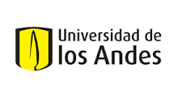

# Evolución 
    
    Curso Virtual, Universidad de los Andes 2020-10
    Profesor: C. Daniel Cadena (ccadena@uniandes.edu.co)
    Asistente Graduada: María Alejandra Meneses (ma.meneses10@uniandes.edu.co)    
    Horario: martes, miércoles y jueves, 9:30-10:20 am en SicuaPlus

       
# La Teoría Evolutiva Aplicada a Comprender una Pandemia: el Caso de COVID-19

Distribución geográfica y filogenia de basada en genomas del corononavirus SARS-CoV-2, causante de la pandemia de COVID-19. Imagen tomada el 23 de marzo de 2020 del proyecto [Nexstrain](https://nextstrain.org/).
    
## Objetivos de aprendizaje

-	Comprender cómo los análisis filogenéticos pueden emplearse para monitorear la expansión de una enfermedad infecciosa emergente.

-	Usando como estudio de caso la pandemia de COVID-19, conocer cómo conceptos fundamentales en evolución pueden aplicarse a un problema de salud pública con importantes implicaciones para la sociedad.

## Competencias a desarrollar

-	Habilidad para hacer inferencias biogeográficas y evolutivas a partir de árboles filogenéticos.

-	Destreza en la aplicación correcta de conceptos evolutivos para el estudio de un problema de salud pública.

-	Capacidad de divulgar información científica para un público amplio mediante herramientas audiovisuales.

## Instrucciones para los estudiantes

### Antes de comenzar

Los estudiantes de UniAndes inscritos en este curso ya han tomado ocho semanas de introducción a la evolución. El material que desarrollaremos de ahora en adelante construye sobre esa base e introduce conceptos que estaban programados para fases más avanzadas del curso. Si bien personas externas no tuvieron acceso a las ocho semanas previas y no podrán participar de las clases virtuales pues éstas se impartirán a través de la plataforma cerrada de la universidad, he decidido dar libre acceso a todo el material para que a quien le interese la información pueda conocerla. Para facilidad de compartirlas, las presentaciones de las clases en este sitio estarán disponibles en un formato de baja resolución que espero sea suficiente para poder comprenderlas. Debo aclarar que no soy experto en detalles de este tema complejo, de forma que seguramente cometeré errores e imprecisiones. Los invito a enviarme correcciones y sugerencias para construir colectivamente un recurso valioso de información.

### Martes 24 de marzo

Vivimos una coyuntura única en la historia reciente de la humanidad. Esta coyuntura supone enormes desafíos para nuestra sociedad, pero al mismo tiempo representa una oportunidad de aplicar nuestros conocimientos y adquirir conocimentos nuevos en un contexto de gran importancia científica y social. Vamos a aprovechar esa oportunidad para estudiar la aplicación de herramientas que ya hemos trabajado en el curso (i.e. árboles filogenéticos) y para aprender sobre el papel que conceptos fundamentales en evolución juegan en el origen y propagación de agentes infecciosos. Dichos conceptos incluyen selección natural, adaptación, evolución molecular, especiación y coevolución, entre otros.

Hoy comenzamos la fase virtual de nuestro curso con una charla a través de la herramienta de **clase remota** de SicuaPlus acerca de aplicaciones del análisis filogenético para estudios de evolución de virus y otros patógenos que afectan la vida silvestre y a los humanos. La presentación está disponible [acá](https://github.com/cdanielcadena/evolucion/blob/master/clase1_git.pdf).

Como lectura complementaria introductoria, pueden revisar apartes el capítulo *Evolutionary Medicine* en el [libro texto](https://www.macmillanlearning.com/college/ca/product/Evolution/p/1936221551) de Zimmer & Emlen.

### Miércoles 25 de marzo

**Instrucciones** 

La primera media hora de la clase la vamos a dedicar a ver un vídeo de una conferencia dictada por [Trevor Bedford](https://twitter.com/trvrb), uno de los cerebros detrás de [Nexstrain](https://nextstrain.org/), un proyecto de acceso libre que busca explotar el potencial científico y de salud pública de datos genómicos de patógenos. Vea por su cuenta la conferencia titulada ["Real-time Tracking of Virus Evolution"](https://youtu.be/Ok2iZ9-cUlk) y nos encontraremos en la ventana de **clase remota** a las 10 am. Anote cualquier pregunta que le surja para discturir en el espacio de reunión virtual que tendremos.

**Desarrollo** 

Luego de que los estudiantes vieron la conferencia, hicimos un pequeño sondeo. Una pregunta apuntaba a examinar si habían prestado atención, y a conectar con un mensaje que quería dejarles hoy y que describo más adelante. Otra pregunta buscaba mostrarles que la terminología que se usa en sistemática filogenética es aplicable al caso del estudio de epidemias. Si bien varios no contestaron correctamente esta última, en la discusión demostramos la correcta utilización de los conceptos de monofilia y parafilia con base en ejemplos de filogenias de los virus de Zika y Ebola. 

Luego, conectando con la primera pregunta del sondeo, ilustramos lo que parece ser un patrón común en epidemias: los virus circulan en poblaciones humanas tiempo antes de que se manifiesten con efectos evidentes en la salud humana. Así sucedió con (1) HIV en los Estados Unidos en los 70s, (2) Zika en Brasil en 2014-2015 y (3) COVID-19 en el estado de Washington, Estados Unidos, en 2020. El COVID-19 circuló sin ser detectado por semanas en Washington, pero el caso de Zika en Brasil tomó un año y medio y el de HIV en Estados Unidos varios años. Este mensaje motivó preguntas de los estudiantes y nos permitió discutir brevemente sobre la importancia de las pruebas de diagnóstico para efectos de vigilancia epidemiológica. Mencionamos, en respuesta a una pregunta, que la demora entre la llegada de los virus a un lugar y su efecto evidente en salud pública puede deberse tanto a las demoras en la incubación de la enfermedad en los infectados (como en COVID-19) como a posibles cambios en el virus que incrementan su virulencia o transmisibilidad (como en HIV). 

Cerramos la cesión haciéndoles ver a los estudiantes que para inferir cuál fue el momento de introducción de un agente infeccioso a un lugar tenemos que hacer suposiciones que se basan en principios de evolución. Por esto mañana nos encontraremos para una clase virtual sobre bases de evolución molecular necesarias para continuar estudiando este tema. 

La presentación de hoy incluyendo el sondeo y los resultados está disponible [acá](https://github.com/cdanielcadena/evolucion/blob/master/clase2_git.pdf).

### Jueves 26 de marzo

Hoy tuvimos una sesión de clase introduciendo principios básicos de teoría de evolución molecular que son clave para poder entender varios aspectos de las enfermedades infecciosas. Comenzamos mostrando cómo los primeros estudios de variación genética en poblaciones naturales basados en técnicas como la electroforesis de proteínas produjeron resultados sorprendentes dado lo que muchos investigadores esperaban tras la Síntesis Moderna de la primera mitad del siglo XX. La evidencia empírica sugirió que las poblaciones contenían mucha más variabilidad genética que lo que se esperaría si la fuerza evolutiva principal fuera selección natural. Luego introdujimos la teoría neutral de evolución molecular de Kimura (y la teoría casi neutral de Ohta), que sugiere que la mayor parte de la variación genética tiene efectos neutros en el *fitness* y le atribuye un papel fundamental a la deriva genética como fuerza de cambio evolutivo. Terminamos explicando cómo podemos hacer inferencias acerca del papel de distintas formas de selección y de deriva en la evolución a partir de comparaciones de secuencias de ADN entre organismos emparentados o para los mismos organismos en distintos momentos en el tiempo. El martes continuaremos hablando de evolución molecular terminando el tema de teoría neutral e introduciendo un marco conceptual clave para comprender la evolución de los virus que causan epidemias: la idea del reloj molecular. La presentación de hoy está [disponible](https://github.com/cdanielcadena/evolucion/blob/master/clase3_git.pdf).
